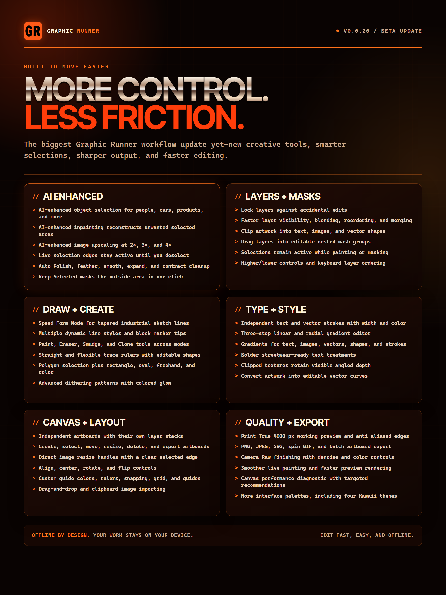

# Graphic Runner

Graphic Runner is a free offline desktop graphics studio for text, images,
logo-vector artwork, symbols, sketching, and print effects. The public beta is
proprietary freeware, not open-source software.

## Download v0.0.20

Download the current Windows and native Linux builds from the
[official v0.0.20 release](https://github.com/RunnerLabs/graphic-runner/releases/tag/v0.0.20).

- `GraphicRunner-0.0.20-Windows-Portable.zip` - Windows 10/11 portable package.
- `graphicrunner_0.0.20_amd64.deb` - native Ubuntu/Debian x64 package.
- `GraphicRunner-Linux-x64-0.0.20.tar.gz` - portable native Linux x64 bundle.
- `SHA256SUMS.txt` - checksums for every v0.0.20 download.

Every package includes Graphic Runner's Java runtime. Users do not need to
install Java separately.

## What is new in v0.0.20



- AI-enhanced object selection, selection cleanup, feathering, and local
  inpainting.
- Dedicated Paint Color eyedropper in Image mode: press **Pick**, then sample
  an exact visible canvas color to make it the active brush color.
- Speed Form Mode with tapered industrial-sketch profiles and round or block
  marker tips.
- Independent, movable, resizable artboards with separate layer stacks and
  single or batch export.
- Persistent selections, polygon selection, invert selection, masking actions,
  layer locking, clipping, and faster layer interaction.
- Direct image corner resizing, cropping, alignment, rotation, flipping, and
  Convert to Curves handoff.
- Paint, eraser, smudge, clone, trace rulers, gradients, independent strokes,
  expanded dithering/glow, and additional themes.
- Print True 4000 px preview, Camera Raw finishing, performance diagnostics,
  native Linux packaging, and source-free public downloads.

## Windows installation

1. Download `GraphicRunner-0.0.20-Windows-Portable.zip`.
2. Verify its SHA-256 checksum against `SHA256SUMS.txt`.
3. Extract the ZIP, open its `GraphicRunner` folder, and run `GraphicRunner.exe`.
4. Accept the beta license when Graphic Runner opens.
5. Because this beta is not digitally signed yet, Windows may show **Windows
   protected your PC**. After verifying the checksum, select **More info**,
   confirm the app name, and select **Run anyway**.

Do not disable Microsoft Defender or SmartScreen. Trusted code signing is the
permanent fix for the unsigned-publisher warning.

## Native Linux installation

Graphic Runner v0.0.20 includes native x64 Linux builds. Wine and Bottles are
not required.

### Ubuntu/Debian package

Download `graphicrunner_0.0.20_amd64.deb`, verify its checksum, then run:

```bash
sudo apt install ./graphicrunner_0.0.20_amd64.deb
```

Launch **GraphicRunner** from the desktop application menu.

### Portable Linux bundle

Download `GraphicRunner-Linux-x64-0.0.20.tar.gz`, verify it, then run:

```bash
tar -xzf GraphicRunner-Linux-x64-0.0.20.tar.gz
./GraphicRunner/bin/GraphicRunner
```

The portable bundle includes Java but still needs a graphical Linux desktop
and the normal X11/font libraries. The DEB declares its runtime dependencies.

## Verify your download

```text
1B57EBBA4140929950A7C96614C9106647740818CE5F6A9E7314A6324397927C  GraphicRunner-0.0.20-Windows-Portable.zip
6907D5E21C9A4A2C78CED93D76541819A21569790D521BCD15B22578B770FE21  graphicrunner_0.0.20_amd64.deb
843CC0EC94B7A880B0BE6A39C90981C49CE0290115B6539D946D6FB13EE8EC78  GraphicRunner-Linux-x64-0.0.20.tar.gz
```

Windows:

```powershell
Get-FileHash .\GraphicRunner-0.0.20-Windows-Portable.zip -Algorithm SHA256
```

Linux:

```bash
sha256sum graphicrunner_0.0.20_amd64.deb
```

## Privacy and source protection

Graphic Runner operates locally and does not upload artwork. This public
repository contains only the website, user-facing documentation, and compiled
release downloads. Application source code and private build files are not
included.

## AI-enhanced features, privacy, and acceptance

By installing, launching, or using Graphic Runner, including any AI-enhanced
feature, you acknowledge and agree to the terms included with the application.
AI-enhanced features perform only their described editing functions: helping
select objects, reconstructing a selected image area, and enhancing image
resolution when the user explicitly requests those actions.

Graphic Runner does not use AI-enhanced features to collect personal data,
upload artwork, monitor activity, build profiles, train on user content, or
retain user content for another purpose. Processing stays on the user's device.
No account, telemetry system, cloud service, or remote AI service is involved.
Only the local acceptance record and app settings are stored automatically;
files are otherwise saved when the user chooses to save or export them. Users
remain responsible for reviewing results and for the content they create,
import, publish, or distribute. The included license contains the complete
terms governing use of Graphic Runner.

## Acceptable use

Each package includes `README_FIRST.txt`, `LICENSE.txt`, the EULA v2.1,
`SECURITY.md`, and `THIRD-PARTY-NOTICES.txt`. Users are responsible for their
content and must have the rights required for every image, font, logo,
trademark, and other item they use. Users may share the official release link
but may not redistribute, sell, rebrand, relabel, host, or pass off Graphic
Runner as their own application.

## Support

Send product feedback through the
[Graphic Runner Beta Feedback form](https://forms.gle/xRCnM3ARTG7ps8CYA).

Security reports and private feedback: `taskmaster@trunner.net`

Copyright 2026 Patrick Jamison. All rights reserved.
